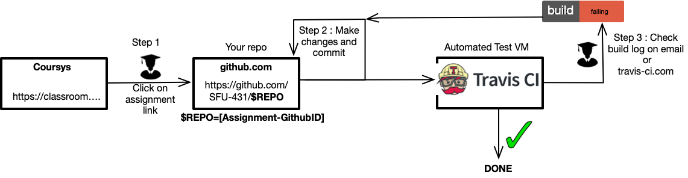
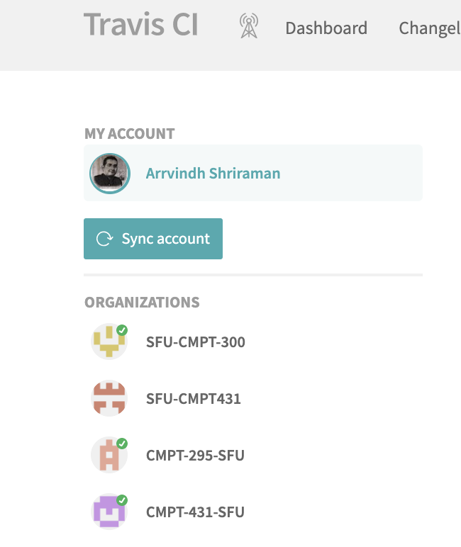
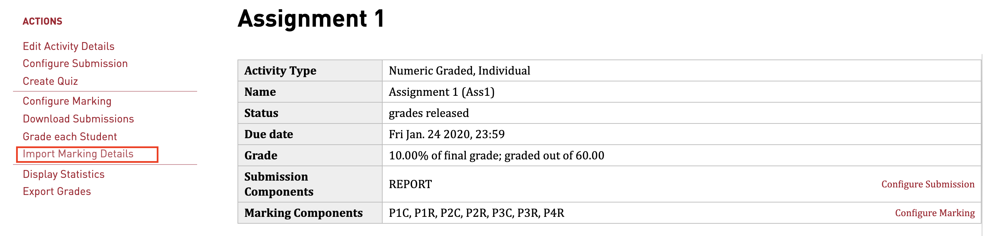

# TA

```
git clone --recurse-submodules -j8 git@github.com:CMPT-295-SFU/TA.git
```

This repository includes three tools

- TA-tools (a set of python scripts for interacting with student repositories)
- Moss (a set of scripts for catching cheaters)
- Travis (a set of command for interacting with TravisCI)

**TA-tools will run on MacOS and Linux. But moss will only run on ubuntu 18. Requires python 3.6+**

- If you have sudo access [Install python3.6 on ubuntu](http://ubuntuhandbook.org/index.php/2017/07/install-python-3-6-1-in-ubuntu-16-04-lts/)
- [Anaconda Python](https://docs.anaconda.com/anaconda/install/linux/). Make sure you get the 3.6+ python version.

[TA Duties](#ta)

- [TA](#ta)
  - [First steps](#first-steps)
  - [Autograding](#autograding)
  - [Install dependencies](#install-dependencies)
  - [TA workflow](#ta-workflow)
    - [1. Conduct weekly labs and TA hours (2hr per week).](#1-conduct-weekly-labs-and-ta-hours-2hr-per-week)
    - [2. Assignment Guidance on Groups](#2-assignment-guidance-on-groups)
    - [3. Assignment Deadline. ( 15 mins per 2 weeks)](#3-assignment-deadline--15-mins-per-2-weeks)
    - [4. Assignment Grading (1 hr per 2 weeks)](#4-assignment-grading-1-hr-per-2-weeks)
    - [5. Catching Cheating (10 minutes per 2 weeks)](#5-catching-cheating-10-minutes-per-2-weeks)
      - [Copy files from repos and create MOSS-compatible folder](#copy-files-from-repos-and-create-moss-compatible-folder)
    - [6. Check into grading repo and send instructor an email.](#6-check-into-grading-repo-and-send-instructor-an-email)

## First steps

- Get a github education account (https://education.github.com/students).
- Register for TravisCI (https://travis-ci.com/).
- Read this document to the end.

## Autograding



The above flowcharts shows the student worklflow for a CMPT 295 assignment.

- CMPT 295 provides a template repository for each assignment (e.g., named assignment-x). This is created at https://classroom.github.com (Classrooms can be created by anyone with an education account).
- Student clones a repo. This will create a repo https://github.com/CMPT-295-SFU/[assignment-x]-[Student GithubID] ). This naming scheme makes it easy to clone all assignments related to a specific assignment.
- Students makes a commit; TravisCI runs the repo and provides immediate feedback on what has failed and succeeded.

**Check yourself**

- what is travis ?
- How are student repos named in github classrooom?

## Install dependencies

```
# Installs python API for github
pip3 install --user PyGithub
python3 -m pip install pygithub
```

- **_ Step 1 _** [Create github id](https://education.github.com/students)
  If you already have github id; upgrade to education by following instructions on site.
- **_ Step 2 _** [Set up github access keys to permit access to github. See gif below](https://help.github.com/en/enterprise/2.15/user/articles/adding-a-new-ssh-key-to-your-github-account)

**_Overwrites existing key if you have passwordless login already setup. If you already have password less login set up, simply copy your public key to github_**

```
cd ~/.ssh
ssh-keygen # Generates SSH keys (creates two files id_rsa and id_rsa.pub)
ssh -T git@github.com
# By default id_rsa is used for authenticating with github
# Copy id_rsa.pub to github
# If things went correct. You should see a Hi... msg when you try sshing into github
```

- **_ Step 3 _** [Register for travis education](https://education.travis-ci.com/) with your github id.
- **_ Step 4 _** [Apply student pack](https://help.github.com/en/articles/applying-for-a-student-developer-pack)
- **_ Step 5 _** [Fill github SFU form](https://docs.google.com/forms/d/e/1FAIpQLScMhVLhzF8YTHFMTV8JxFOZsvLRjWgHlX8AHtxSLhHn1DtB1w/viewform?usp=sf_link)

```
# Install Perl 5.10 for moss
sudo apt-get install perlbrew
perlbrew init
source ~/perl5/perlbrew/etc/bashrc
perlbrew install perl-5.10.1
# Might complain about error, but that's ok.
cd ~/perl5/perlbrew/build/perl-5.10.1/perl-5.10.1; make install
perlbrew switch perl-5.10.1

# Install Travis CLI
sudo apt install ruby-full
ruby -v
gem install travis
travis version

# If you created a token on github
# travis login --com -E --github-token
travis login --com

Shell completion not installed. Would you like to install it now? |y| y
We need your GitHub login to identify you.
This information will not be sent to Travis CI, only to api.github.com.
The password will not be displayed.
Try running with --github-token or --auto if you don't want to enter your password anyway.

Username: [Enter your github id]
password: [Enter your github password]
# https://travis-ci.com/ (Under settings/organization.
# CMPT-295-SFU should be listed. If you do not see CMPT-295-SFU, talk to the instructor)
```



## TA workflow

### 1. Conduct weekly labs and TA hours (2hr per week).

To access all repos and slides listed here access them through the lab page on the website
https://www.cs.sfu.ca/~ashriram/Courses/CS295/labs.html

- You will be leading every lab and tutorial session (there is one every week, unless specified). Conduct synchronous tutorial sessions and office hours through zoom or in person.
- Repo naming scheme ( [X]-Lab-[#] X - C/RISCV/Cache/... # (1,2,3,4)). X is indicates the module, # indicates the Week number.
- Each lab will include two repos a public repo available to all students and a private repo only visible to the TA.

e.g., C-Lab-1 (public repo made available to the student) C-Lab-1-Solution (private repo and only visible to the TAs. **DO NOT RELEASE TO THE STUDENTS UNDER ANY CIRCUMSTANCE. YOU CAN SHOW IT IN A VIDEO**.

- In each lab the student will go through a set of exercises. To help them first present the background slides (in some labs I will include a video. Ask them to watch the video).

- Following this let the students work through the material. Periodically, walk the students through the solutions and tell them answers.

### 2. Assignment Guidance on Groups

(15 mins Daily)

- You have each been assigned two assignments as the head TA. **You are responsible for answering all questions on the groups related to the assignment. Expected response time < 30 min**
- You may and should guid students with debugging **For coding related questions you may take up to 24hrs to respond**.
- The above time deadlines are not strictly enforced, but do your duty. All assignments are autograded in CMPT 295, hence the primary requirement of TAs is in helping students complete the assignments and labs.

### 3. Assignment Deadline. ( 15 mins per 2 weeks)

**Goal:** The assignments are autograded on travis. The steps here transfer the logs of all repos to a SFU CS machine (travis-log). You will be running some scripts on the folder with these logs. Feedback will be provided in two ways

- Merging the grades of all students into a single file and uploading to coursys.
- Updating the log files and committing it back to the repos.

  These steps are to be implemented by the Head TA only (Head TA: TA who has been handled the grading duties for the particular assignment.)

-

1. **On the day after the assignment deadline set repos to read-only and start autograders.**

The following steps assume assignment-1. Please change to the appropriate number based on your

```
# Set organization name
export ORG=CMPT-295-SFU
# Set Assignment number
export ASS=assignment-1-
# The grader box on 199.60.17.67 where travis will dump grade files
export ASS_ROOT=ASS1

cd TA-tools
python ./git_gud.py set_readonly -o=$ORG $ASS
# if you see syntax error, check your python version is 3.6+
```

2.  **Ensure autograder box (\$ASS_ROOT) is set up on travis-log sfu machine. This is the folder in which the grade files will be found after the autograder has run.**

```
cd ~/.ssh/
wget "https://drive.google.com/uc?export=download&id=162VYNkMEBuKrc7GqEnToDpJMhUjOedBR" -O ~/.ssh/travislog_rsa
chmod 600 ~/.ssh/travislog_rsa
ssh root@199.60.17.67 -i ~/.ssh/travislog_rsa
# The following steps are run on the travis-log machine.
# define ASS_ROOT if you have to.
rm -rf $ASS_ROOT/PASS/*
rm -rf $ASS_ROOT/FAIL/*
ls $ASS_ROOT/PASS
ls $ASS_ROOT/FAIL
# if the folders do not exist, create them.
```


- **Cross check the name of the assignment and ORG.**
- **Pay particular attention to - at the end of ASS.**
- **Check if ASS_ROOT exists on travis-log machine.**
- **Ensure folder is set up as follows**.

3. **Set environment variables and kickstart autograders**

```
# Set GRADER_SSH (enables travis machines to connect to 199.60.17.67)
travis repos --active --owner $ORG -m $ORG/$ASS"*" --com | xargs -I % travis env set GRADER_SSH "https://drive.google.com/uc?export=download&id=162VYNkMEBuKrc7GqEnToDpJMhUjOedBR" -r %

# Set assignment root folder to gradebox
travis repos --active --owner $ORG -m $ORG/$ASS"*" --com | xargs -I % travis env set ASS_ROOT $ASS_ROOT -r %

# If password needs to be set. Required only for assignment 4

travis repos --active --owner $ORG -m $ORG/$ASS"*" --com | xargs -I % travis env set PASSWORD "c@che1ab" -r %

# Restart graders.
travis repos --active --owner $ORG -m $ORG/$ASS"*" --com | xargs -I % travis restart -r %
```

- Go to travis-ci.com. Click on running and check that \$ASS runners are running (i..e., queue is non zero.)
  


### 4. Assignment Grading (1 hr per 2 weeks)

**_Grades and feedback to be released within 5 days after the assignment deadline_**
**_DO NOT RELEASE THE GRADES. Instructor will do so. you only have to upload to coursys and push feedback to student repos_**

- Go to travis-ci.com. Click on running and check that \$ASS runners are running (even if running is non-zero. assignment-1 runner may have finished. Check the queue).
  
  
 ```bash
 # Check if any of the runners errored spuriously. If so restart them
  travis repos --active --owner CMPT-295-SFU -m "CMPT-295-SFU/assignment-4-*" --com | parallel 'travisstate=`travis status -r {}`;echo {}.$travisstate' | grep errored. 
# Restart student repo, if required  
 travis repos --active --owner $ORG -m $ORG/[Student Repo] --com | xargs -I % travis restart -r %
 ```

1. **Copy autograde files to local machine and create coursys upload**

- Go to travis-ci.com. Click on running and check that all assignment-1 runners have completed (even if running is non-zero assignment-1 runner may have finished. Check the queue).
  

```
# copy gradebox from file.
cd TA
mkdir $ORG
cd $ORG
scp -i ~/.ssh/travislog_rsa -r root@199.60.17.67:~/CMPT295/$ASS_ROOT .
cd $ASS_ROOT
export GRADE_ROOT=$PWD
```

The organization of the autograder files with \$ASS_ROOT
PASS : A folder containing log files on all students that passed
FAIL : A folder containing log files on all students that have atleast one test case failing.
Each student has two files

- [assignment repo].log
- [assignment repo]\_Grade.json

```
cd TA/TA-tools
python3 -m JsonFolder2Coursys.Json2Coursys -C $PWD/Students.csv -D $GRADE_ROOT/PASS/ > Coursys_PASS.json
python3 -m JsonFolder2Coursys.Json2Coursys -C $PWD/Students.csv -D $GRADE_ROOT/FAIL/ > Coursys_FAIL.json
# Upload Coursys_PASS.json and Coursys.FAIL.json to coursys.
```

**You can upload both Coursys_PASS and Coursys_FAIL.json to coursys.json. Look for the import marking**


**If any users were not found, check the yellow messages on the screen.**
A common problem is student githubids do not exist in Students.csv (they did not fill out the form or they wrote the wrong student id. Make sure that students in your cohort fill out google form in lab 0).

2. **Provide grade feedback to failed students**

It is important that you provide feedback to the students who had failed logs.
These set of scripts

- Uses the local directory of previously mass cloned repositories as well as your feedback to all students in a Markdown document
- It will parse the markdown file, matching students with their feedback, and then match it with the repositories in the directory.
- The matched feedback is added to the student repository, committed and pushed to remote (probably GitHub Classroom)

Comment file

```
### student-github-name

    - comments
    - more comments
    - comments can be any markdown (NO ### tags)

### Another student github-name
```

**To generate a templated comment file AND FILL IT**

```
cd TA-tools
python3 log2gradingtemplate.py $GRADE_ROOT $ASS Students.csv

# First parameter . Relative path to current directory assignment log files copied from travis-log

# Second parameter : prefix used to name the assignment in github. e.g., assignment-1- (check classroom.github.com). The "-" at the end of the prefix is important

# Student CSV file from Github reponse sheet.
```

This will create two files: PASS.md and FAIL.md. PASS.md contains template for all students that passed. FAIL.md is the template for all students that failed.

**IMPORTANT: Fill OUT FAIL.md as you read the log files in \$GRADE_ROOT/FAIL. Keep the log files in case students ask for it.**

**PUSH GRADING FEEDBACK INTO REPO (Fill coursys json entry as you do this)**

```

python3 ./git_gud.py ls -o=$ORG $ASS
python3 ./git_gud.py clone -o=$ORG $ASS

# This will clone all the repos

# For Pass.md, you do not need to fill any comments.

# Fill comments in faild.md. Use the log files in \$GRADE_ROOT

mv FAIL.md GRADING.md
python3 ./git_gud.py push-grade-sheet -o=$ORG $ASS

```

**Validating students exist**

If after uploading to coursys, you find some students got 0 or no entry in the logs (but exist on coursys).

- Check their repo exists (use their SFUID and lookup Students.csv to find their githubid. Then check github.com/CMPT-295-SFU)
- Check their repo run on travis-ci.com (sometimes travis-ci may have I/O failures).

```

# You can restart just their job as follows

travis repos --active --owner $ORG -m $ORG/[Student-REPO] --com | xargs -I % travis restart -r %

```

### 5. Catching Cheating (10 minutes per 2 weeks)

- Uses the local directory of previously mass cloned repositories
- It will go through all student repositories and pick up files specified in
  MOSS_FILES in config.ini (e.g., MOSS_FILES = part1.c,part2.c,utils.c). Look at the
  assignment solution repo for MOSS_FILES.

#### Copy files from repos and create MOSS-compatible folder

```
cd TA-tools
python3 ./git_gud.py clone -o=$ORG $ASS
```


- Have you set MOSS_FILES in config.ini for this assignment
- You can refer to the TA solution repo. You will find a MOSS_FILES.
- Set config.ini to the text content of that file.

```
python3 ./git_gud.py moss -o=$ORG $ASS
```

This will create a Moss/ (with a capital M)


- `ls Moss/*`
- Ensure each student folder has files in it.

```
cd ../moss
perl ./moss.pl -d ../TA-tools/Moss/*/*
# If you see any errors wit CTime; ensure you have the appropriate perl dependencies installed.
# If you see any folder related errors. Check if Moss/[Repo]/ has any files
# If there are no files. Check if you set the file list in config.ini before running
# the previous step.
mv html $ASS"html"
tar -cvzf $ASS"html".tar.gz $ASS"html"
```

### 6. Check into grading repo and send instructor an email.

**Congratulations; you are done!**

```
git clone git@github.com:CMPT-295-SFU/Grading.git
cd Grading
mkdir $GRADE_ROOT
# Files to add in this folder.
- PASS.md
- FAIL.md
- PASS_Coursys.json
- FAIL_Coursys.json
- $ASS"html".tar.gz
git add *
```
